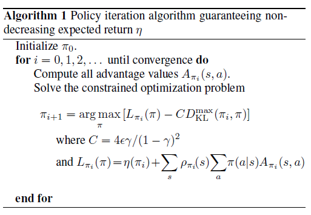

# Trust Region Policy Optimization, Berkeley, 2017
Arxiv: https://arxiv.org/abs/1502.05477  
Blog: https://medium.com/@jonathan_hui/rl-trust-region-policy-optimization-trpo-explained-a6ee04eeeee9

## Overview
TRPO is constructed on:
1. Minimizing surogate function that guarantees policy improvement.
2. Approximating some of components of the surogate function (better efficiency)
3. Using two approaches: one for model free and one for simulation environments.

> [...] we first prove that minimizing a certain surrogate 
> objective function guarantees policy improvement
> with non-trivial step sizes. Then we make a series of approximations
> to the theoretically-justified algorithm, yielding
> a practical algorithm, which we call trust region policy
> optimization (TRPO). We describe two variants of this
> algorithm: first, the single-path method, which can be applied
> in the model-free setting; second, the vine method,
> which requires the system to be restored to particular states,
> which is typically only possible in simulation.

## Detailed analysis

### Preliminaries

Expected discounted reward when using policy $\pi$ ( $a_t \sim \pi(a_t|s_t)$ )
$$
\eta(\pi) = \mathop{\mathbb{E}}_{\pi} [\sum^\infin_{t=0}\gamma^t r(s_t)]
$$

Expected return of another policy $\tilde \pi$ in terms of the advantage over policy $\pi$

$$
\eta(\tilde \pi) = \eta(\pi) + \mathop{\mathbb{E}}_{\tilde \pi} [\sum^\infin_{t=0}\gamma^t A_\pi(a_t, s_t)]
$$

> [...] the update performed by exact
> policy iteration [...] improves the policy if there is
> at least one state-action pair with a positive advantage value
> and nonzero state visitation probability, otherwise the algorithm
> has converged to the optimal policy. However, in the
> approximate setting, it will typically be unavoidable, due
> to estimation and approximation error, that there will be
> some states s for which the expected advantage is negative,
> that is, $\sum_a \tilde{\pi} (a|s) A_\pi(s,a,) > 0$
> 
Local approximation to the above equation (we only compare the decision and follow the old policy $\pi$)

$$
L_\pi (\tilde \pi) = \eta(\pi) + \sum_s\rho_\pi (s) \sum_a \tilde\pi(a|s) A_\pi(a_t, s_t)
$$

where $\rho_\pi (s)$ is the (unnormalized) discounted visitation frequencies under policy $\pi$
$$
\rho_\pi (s) = P(s_0 = s) + \gamma P(s_1 = s)  + \gamma^2 P(s_2 = s)+...
$$

This approximation has the same gradient for $\theta_0$ (the policy parameters vector)
$$
L_{\pi_{\theta_0}} (\pi_{\theta_0}) = \eta(\pi_{\theta_0})
$$
$$
\left.\nabla_\theta  L_{\pi_{\theta_0}} (\pi_{\theta}) \right |_{\theta_0} = \left.\nabla_\theta  \eta(\pi_{\theta}) \right |_{\theta_0} 
$$

Conservative policy iteration update and its lower bound for updating the policy
$$
\pi_{\text{new}}(a|s) = (1 - \alpha) \pi_{\text{old}}(a|s) +\alpha \pi'(a|s)
$$

where $\pi'(a|s)= \text{argmax}_{\pi'}L_{\pi_{\text{old}}}(\pi')$

$$
\eta(\pi_{\text{new}}) \geq L_{\pi_{\text{old}}}(\pi_{\text{new}}) - \frac{2\epsilon\gamma}{(1 - \gamma) ^ 2} \alpha^2
$$
where $\epsilon = \underset{s}{\text{max}}|\mathop{\mathbb{E}}_{a \sim \pi'(a|s)}  [A_\pi (s, a)]|$

### Monotonic Improvement Guarantee for General Stochastic Policies
If we will replace $\alpha$ with distance measure between policies instead of using mixture policies,
we extend this to the __general stochastic policies__.

First example of distance measure is the total variation divergence
$$
D_{TV}(p||q) = \frac{1}{2}\sum_i|p_i-q_i|
$$
where $q$ and $p$ are discrete probability distributions.

Define $D_{TV}^{\text{max}}$ as

$$
D_{TV}^{\text{max}}(\pi, \tilde\pi) = \underset{s}{\text{max}} \ D_{TV}(\pi(\cdot | s)||\tilde \pi(\cdot | s))
$$

If $\alpha = D_{TV}^{\text{max}}(\pi_{\text{old}}, \pi_{\text{new}})$ then the lower bound is

$$
\eta(\pi_{\text{new}}) \geq L_{\pi_{\text{old}}}(\pi_{\text{new}}) - \frac{4\epsilon\gamma}{(1 - \gamma) ^ 2} \alpha^2
$$
where $\epsilon = \underset{s, a}{\text{max}}|A_\pi (s, a)|$

The relationship between total variation divergence and the KL divergence

$$
D_{TV}(p||q)^2 \leq D_{\text{KL}}(p||q)
$$

Let 
$$
D_{\text{KL}}^{\text{max}}(\pi, \tilde\pi) = \underset{s}{\text{max}} \ D_{\text{KL}}(\pi(\cdot | s)||\tilde \pi(\cdot | s))
$$

So the lower bound will be

$$
\eta(\tilde\pi) \geq L_{\pi}(\tilde\pi) - C D_{\text{KL}}^{\text{max}} (\pi, \tilde\pi)
$$
where $C = \frac{4\epsilon\gamma}{(1 - \gamma) ^ 2}$

In the paper there is a proof that making updates this way guaranteeing nondecreasing 
expected return $\eta$.

### Optimization of Parameterized Policies
> In the previous section, we considered the policy optimization
> problem independently of the parameterization of $\pi$
> and under the assumption that the policy can be evaluated
> at all states.

__Therefore we will change notation to express dependency on the policy parameters $\theta$.__

By performing following maximization, we are guaranteed to imporve the true objective $\eta$

$$
\underset{\theta}{\text{maximize}}[L_{\theta{\text{old}}}(\theta) - C D_{\text{KL}}^{\text{max}}(\theta_{\text{old}}, \theta)]
$$

> In practice, if we used the penalty coefficient C recommended
> by the theory above, the step sizes would be very
> small. One way to take larger steps in a robust way is to use
> a constraint on the KL divergence between the new policy
> and the old policy, i.e., a trust region constraint:

$$
\underset{\theta}{\text{maximize }}L_{\theta{\text{old}}}(\theta)
$$
$$
\text{suject to } D_{\text{KL}}^{\text{max}}(\theta_{\text{old}}, \theta) \leq \delta
$$

Because it is bounding KL divergence at every point in the space it is impractical to solve and we use heuristic approximation to the $D_{\text{KL}}^{\text{max}}$ by:

$$
\overline{D}_{\text{KL}}^{\rho_{\theta_{\text{old}}}} (\theta_1, \theta_2) := \mathop{\mathbb{E}}_{s \sim \rho} [D_{\text{KL}}(\pi_{\theta_1}(\cdot | s)||\pi_{\theta_2}(\cdot | s))]
$$

and optimize

$$
\underset{\theta}{\text{maximize }}L_{\theta{\text{old}}}(\theta)
$$
$$
\text{suject to } \overline{D}_{\text{KL}}^{\rho_{\theta_{\text{old}}}}(\theta_{\text{old}}, \theta) \leq \delta
$$

### Sample-Based Estimation of the Objective and Constraint

We will expand previos equation to 

$$
\underset{\theta}{\text{maximize }} \sum_s \rho_{\theta{\text{old}}}(s) \sum_a \pi_\theta(a, s) A_{\theta_{\text{old}}}(s, a)
$$
$$
\text{suject to } \overline{D}_{\text{KL}}^{\rho_{\theta_{\text{old}}}}(\theta_{\text{old}}, \theta) \leq \delta
$$

and do following approximations:
1. Replace  $\sum_s \rho_{\theta{\text{old}}}(s)[...]$ with the expectation $\frac{1}{1 - \gamma}\mathop{\mathbb{E}}_{s\sim \rho_{\theta{\text{old}}}}[...]$ (in the maximization constant can be skipped)
2. Replace $A_{\theta_{\text{old}}}$ with the Q-value $Q_{\theta_{\text{old}}}$ (it just adds constants to all the advantage functions)
3. Replace the sum over the actions by an importance sampling estimator (equation for the contribution of a single state $s_n$):
   $$
   \sum_a \pi_\theta(a | s_n) A_{\theta_\text{old}}(s_n, a) = \mathop{\mathbb{E}}_{a \sim q} \left [ \frac{\pi_\theta(a| s_n)}{q(a|s_n)} A_{\theta_\text{old}}(s_n, a)                               \right ]
   $$
   where $q$ denotes sampling distribution

Which provides us to equivalent form 

$$
\underset{\theta}{\text{maximize }} \mathop{\mathbb{E}}_{s\sim \rho_{\theta{\text{old}}}   ,a \sim q} \left [ \frac{\pi_\theta(a| s)}{q(a|s)} Q_{\theta_\text{old}}(s, a)  \right ]
$$
$$
\text{suject to } \mathop{\mathbb{E}}_{s\sim \rho_{\theta{\text{old}}}} [D_{\text{KL}}(\pi_{\theta_{\text{old}}}(\cdot| s) \ || \ \pi_{\theta}(\cdot| s)) ]\leq \delta
$$

> All that remains is to replace the expectations by sample
>averages and replace the $Q$ value by an empirical estimate.

#### Single Path

> In this estimation procedure, we collect a sequence of
> states by sampling $s_0 \sim \rho_0$ and then simulating the policy
> $\pi_\text{old}$ for some number of timesteps to generate a trajectory
> $s_0, a_0, s_1, a_1, ... , s_{T-1}, a_{T-1}, s_T$. Hence, 
> $q(a|s) = \pi_{\theta_\text{old}} (a|s)$. $Q_{\theta_\text{old}} (s, a)$ is 
> computed at each state-action pair $(s_t, a_t)$ by taking the discounted sum 
> of future rewards along the trajectory.

#### Vine

In this approach there is a following procedure:

1. Sample starting state $s_0 \sim \rho_0$
2. Simulate the policy $\pi_{\theta_i}$ to generate a number of trajectories
3. Choose a subset of N states along these trajectories, denoted $s_1, s_2, ..., s_N$ - we will called it rollout set
4. For each state $s_n$ sample $K$ actions accodring to $a_{n,k} \sim q(\cdot | s_n)$
5. For each action $a_{n,k}$ at state $s_n$ estimate $\hat Q_{\theta_i}(s_n, a_{n,k})$ by performing rollout (short trajectory) starting with state $s_n$ and action $a_{n,k}$

> In small, finite action spaces, we can generate a rollout for every possible action
>  from a given state. The contribution to $L_\text{old}$ from a single state $s_n$ is as follows:
> $$
> L_n (\theta ) = \sum_{k=1}^{K} \pi_\theta(a_k|s_n)\hat Q(s_n, a_k)
> $$
> where the action space is $A = \{ a_1, a_2, ..., a_K \}$
> 
> In large or continuous state spaces, we can construct an estimator of the surrogate
> objective using importance sampling. The self-normalized estimator of $L_\text{old}$
> obtained at a single state $s_n$ is
> $$
> L_n (\theta ) = \frac{\sum_{k=1}^{K} \frac{\pi_\theta(a_{n,k}|s_n)}{\pi_{\theta_\text{old}}(a_{n,k}|s_n)}\hat Q(s_n, a_{n,k})} {\sum_{k=1}^{K} \frac{\pi_\theta(a_{n,k}|s_n)}{\pi_{\theta_\text{old}}(a_{n,k}|s_n)}}
> $$

> The benefit of the vine method over the single path method that is our local estimate 
> of the objective has much lower variance given the same number of Q-value samples in
>  the surrogate objective.

>The downside of the vine method is that we must perform far more calls to the
> simulator for each of these advantage estimates.

### Practical Algorithm

## Related works
Links to the related works
1. [A Natural Policy Gradient, UCL 2002](https://papers.nips.cc/paper/2073-a-natural-policy-gradient.pdf)
2. [A Tutorial on MM Algorithms,  The American Statistician 2004](https://amstat.tandfonline.com/doi/abs/10.1198/0003130042836#.XYNPDigzbZk)

## Questions
1. What are general derivative-free stochastic optimization methods such as CEM and CMA?
2. Why we need to replace $\alpha$ with distance measure between policies? Section 3.  
   Is this just simplifing the $\epsilon$?
3. Why to change from the total variation divergence to the KL divergence?

## Notes

According to OpenAI blog [post](https://openai.com/blog/openai-baselines-ppo/):  
  >TRPO isn’t easily compatible with algorithms that share parameters between a policy and value function or auxiliary losses, like those used to solve problems in Atari and other domains where the visual input is significant